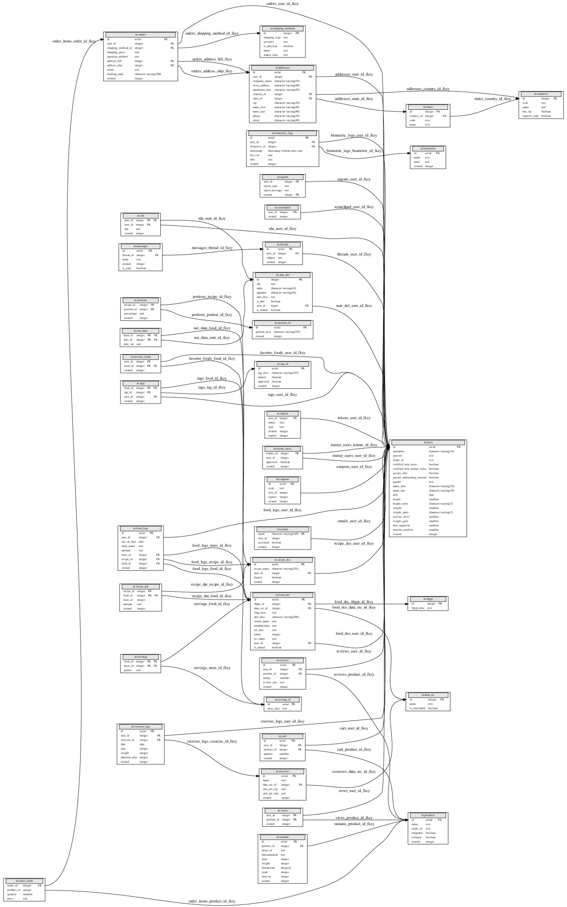

**********
 nutra-db
**********

.. image:: https://api.travis-ci.com/gamesguru/ntdb.svg?branch=master
    :target: https://travis-ci.com/gamesguru/ntdb

Python, SQL and CSV files for setting up nutra-server database.

Setting up local database
#########################

1. Set env var: ``PSQL_LOCAL_DB_DIR``

2. Run ``cd sql`` and ``./local.cmd``

3. Out of the postgres terminal ``\i startup.sql``

Running local database (after init)
===================================

.. code-block:: bash

    cd sql
    ./local.cmd

Tables (Relational Design)
##########################

See ``sql/tables.sql`` for details
This is frequently updated, see ``docs/`` for more details.

